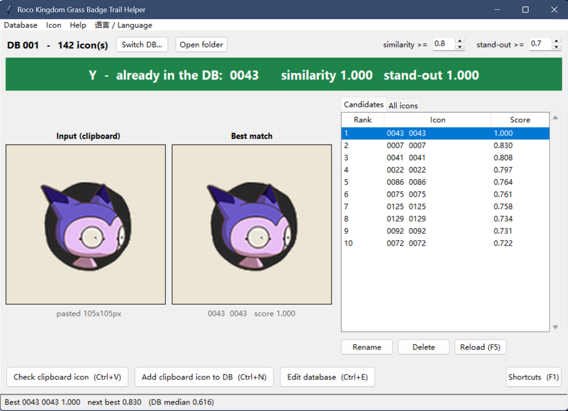

# Roco Kingdom Grass Badge Trial Helper

> Paste a spirit's icon and it tells you whether you have battled it before.

**[简体中文](README.md)**



## What this solves

On the grass badge trial, **the game pays out according to how many different
spirits you have battled at each level** — but the game's UI never tells you
whether you have already fought a given spirit.

This program does it for you:

* **Check one spirit** — copy the spirit's icon from a screenshot, press
  `Ctrl+V`, and see whether the database already holds a similar spirit.
* **Register in bulk** — screenshot the whole on-screen spirit list and press
  `Ctrl+N` to register them all at once; the grid is split into individual icons
  and stored one by one.
* **One database per level** — databases are completely independent of each other.

## Using it

### 1. Download the built program (recommended)

Grab `RocoKingdomTrialHelper.exe` from [Releases](../../releases) and run it — no
Python needed.

> Windows shows a SmartScreen prompt for programs without a digital signature:
> click *More info* → *Run anyway*. Databases are kept in a `data` folder next to
> the exe, so put the exe in a folder of its own.

### 2. Run from source

Windows plus Python 3.10 or newer.

```powershell
.\run.ps1
```

The first run builds `.venv` and installs the dependencies (numpy and pillow),
then starts the GUI. `Get-Help .\run.ps1 -Full` documents everything; the useful
parameters are:

| parameter | what it does |
| --- | --- |
| `-Lang zh\|en` | interface language (Simplified Chinese by default; switchable in-app) |
| `-Root <path>` | use a different folder of databases; created if missing |
| `-Console` | start via `python.exe` so a console window shows any error |
| `-Log <file>` | send output to `<file>` and errors to `<file>.err` |
| `-Wait` | block until the app closes and return its exit code |
| `-Reinstall` | delete and rebuild the virtualenv, then start |
| `-SkipChecks` | skip the environment checks for a slightly faster start |

### 3. Everyday use

On startup, pick a database or create one by typing a number (**one database per
level** works well). Then:

| what you want | how |
| --- | --- |
| check whether you fought this one | copy the icon → `Ctrl+V` |
| register this one | `Ctrl+N` |
| register a whole screen at once | screenshot the list → `Ctrl+N`, then confirm row by row |
| browse / edit the database | `Ctrl+E` |
| reload from disk | `F5` |
| shortcuts and how it works | `F1` |
| switch language | the **语言 / Language** menu |

### How bulk registering works

`Ctrl+N` looks at what you pasted. A **grid screenshot** is split into one crop
per icon and opens a confirmation list where the final call on every icon is yours:

* **left** — the icon you pasted, with an editable name. Tick it to register it
  as a new entry.
* **right** — whatever the database already holds that looks like it, with the
  similarity and stand-out scores. Tick it to keep the stored one and skip yours.

Rows where nothing similar was found default to *register*; rows that might be
duplicates start **unticked and highlighted** — the program never decides for you.
The Import button stays disabled while any row is undecided, and a count at the
bottom shows how many are left. *Undecided → register all* and *Undecided → skip
all* settle the rest in one click.

### Reading the verdict

A green **Y** means you have fought it; a red **N** means you have not. Two
numbers follow:

* **similarity** — how close the most similar stored icon is (0–1).
* **stand-out** — how far it rises above the rest of the database.

A Y needs both above their thresholds. The thresholds are adjustable at the top
right and **saved per database**.

## License

[MIT LICENSE](LICENSE)
