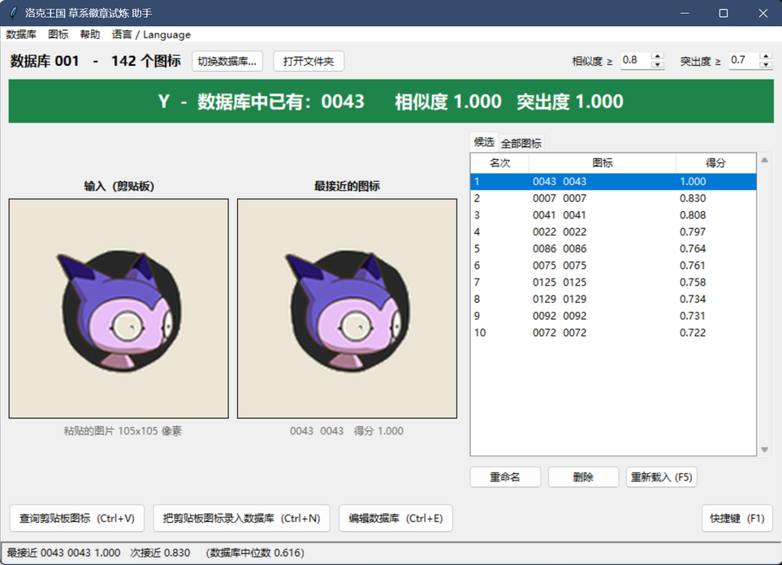

# 洛克王国 · 草系徽章试炼 助手

> 把精灵头像截图粘进来，立刻告诉你这只你打过没有。

**[English](README.en.md)**



## 这个工具解决什么问题

草系徽章试炼里，**游戏按照每个关卡遇对战的精灵数量发放奖励**，但游戏界面不会告诉你这只精灵你之前打没打过。

这个程序替你：

* **查询单个图标** —— 截图复制精灵头像，按 `Ctrl+V`，查看数据库里有无相似精灵。
* **（批量）录入当前数据库** —— 把整屏的精灵列表截一张图，`Ctrl+N` 一次性
  全部登记进去，程序会自动把网格切成一个一个的图标放进数据库。
* **每个关卡段一个数据库** —— 数据库之间互不干扰。

## 怎么用

### 一、下载打包好的程序（推荐）

到 [Releases](../../releases) 下载 `RocoKingdomTrailHelper.exe`，双击就能用，
不需要装 Python。

> Windows 会对没有数字签名的程序弹一个 SmartScreen 提示：点“更多信息”→
> “仍要运行”。数据库会存在 exe 相同层级的 `data` 文件夹里，所以建议把 exe 放在一个
> 专用的文件夹里。

### 二、从源码运行

需要 Windows + Python 3.10 以上。

```powershell
.\run.ps1
```

第一次运行会自动建好 `.venv` 并装依赖（numpy 和 pillow），之后直接启动界面。
`Get-Help .\run.ps1 -Full` 有完整说明，常用参数：

| 参数 | 作用 |
| --- | --- |
| `-Lang zh\|en` | 指定界面语言（默认简体中文，程序里也能随时切换） |
| `-Root <路径>` | 换一个存放数据库的文件夹，不存在会自动创建 |
| `-Console` | 用 `python.exe` 启动，保留控制台窗口，方便看报错 |
| `-Log <文件>` | 把输出写进文件，错误写进 `<文件>.err` |
| `-Wait` | 等程序关闭后再返回，并带回退出码 |
| `-Reinstall` | 删掉虚拟环境重装一遍再启动 |
| `-SkipChecks` | 跳过环境检查，启动快一两秒 |

### 三、日常操作

启动后先选一个数据库，或者填个数字新建一个（**建议一个关卡用一个数据库**）。然后：

| 想做什么 | 怎么做 |
| --- | --- |
| 查这只打过没有 | 截图复制头像 → `Ctrl+V` |
| 把这只登记进去 | `Ctrl+N` |
| 批量登记一整屏 | 截整个列表 → `Ctrl+N`，自动切分后逐行确认 |
| 查看/编辑数据库 | `Ctrl+E` |
| 从磁盘重新载入 | `F5` |
| 快捷键和说明 | `F1` |
| 切换语言 | 菜单栏 **语言 / Language** |

### 如何批量登记

`Ctrl+N` 会先看你粘贴的是什么。如果是**一整张网格截图**，程序会切成一个一个
图标，然后打开一个确认列表，每个图标的最终决定交给你：

* **左边**是你截的图标，可以直接改名字。勾左边 = 作为新条目登记。
* **右边**是数据库里已经有的、跟它很像的那个，附相似度和突出度。勾右边 =
  保留已有的，跳过你这个。

没找到相似图标的行默认勾“登记”；**有可能重复的行默认不选，并高亮**——
程序不会替你做主。只要还有一行没决定，“导入”按钮就一直是灰的，底下还有个
计数告诉你还剩几行。想省事就用“未决定 → 全部登记”或“未决定 → 全部跳过”。

### 判定结果怎么看

绿条 **Y** 表示打过了，红条 **N** 表示没打过。后面跟着两个数字：

* **相似度** —— 数据库里最像的那个图标有多像（0~1）。
* **突出度** —— 它比数据库里其余图标高出多少。

判定为 Y 需要两个都达到阈值，阈值在右上角可以调，**每个数据库单独保存**。

## 许可

[MIT LICENSE](LICENSE)
